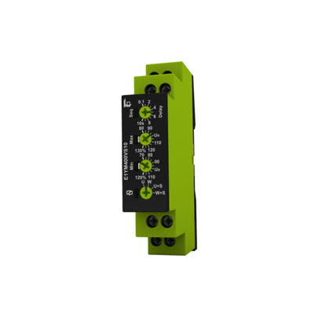
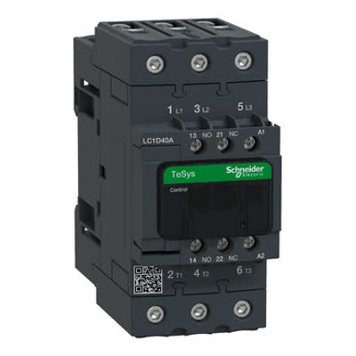
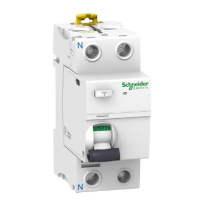

# ელექტრო განაწილების დაფის სპეციფიკაცია

სრული სახელმძღვანელო თანამედროვე, უსაფრთხო ელექტრო განაწილების პანელის აშენებისთვის საცხოვრებელი ობიექტისთვის 17 ინდივიდუალური წრედით. დიზაინი იყენებს მაღალი ხარისხის Schneider Electric კომპონენტებს ინდივიდუალური RCBO დაცვით თითოეული წრედისთვის.

[**Read in English**](README.md) | **ქართულად**

## რა არის ეს სისტემა?

ამ ელექტრო პანელის დიზაინი უზრუნველყოფს:
- **ინდივიდუალურ დაცვას** ყველა წრედისთვის (გაზიარებული დაცვის გარეშე)
- **ავტომატურ ძაბვის მონიტორინგს** რომელიც გათიშავს ელექტროენერგიას ძაბვის პრობლემების შემთხვევაში
- **ელვისგან დაცვას** ძვირფასი ტექნიკის დასაცავად
- **ხანძრისგან დაცვას** დამიწების დენის გამოვლენის მეშვეობით
- **სელექტიურ გამორთვას** - მხოლოდ დაზიანებული წრედი გამოირთვება, დანარჩენები მუშაობენ

## სისტემის მიმოხილვა

### მთავარი დამცავი კომპონენტები (რა მოდის პირველად)

<table>
<tr>
<td width="50%" align="center">

**ძაბვის მონიტორი**<br/>TELE E1YM400VS10



აკონტროლებს შემომავალ ძაბვას<br/>
ააქტიურებს კონტაქტორს ძაბვის პრობლემების დროს

</td>
<td width="50%" align="center">

**კონტაქტორი**<br/>Schneider LC1D40A



მთავარი ჩართ/გამორთ გადამრთველი<br/>
კონტროლდება ძაბვის მონიტორით

</td>
</tr>
<tr>
<td width="50%" align="center">

**მთავარი ავტომატი**<br/>Schneider iC60N 1P+N


გადატვირთვისა და მოკლე შერთვისგან დაცვა<br/>
C40/C50/C63 (აირჩიეთ კონტრაქტის მიხედვით)

</td>
<td width="50%" align="center">

**მთავარი RCD (ხანძრისგან დაცვა)**<br/>Schneider iID 2P 63A/300mA



აღმოაჩენს დამიწების დენს<br/>
დროით დაყოვნებული, ხელს უშლის ხანძარს

</td>
</tr>
<tr>
<td width="50%" align="center">

**ელვისგან დამცავი**<br/>Schneider iPRD 8r 1P+N


ელვისა და ძაბვის სკოკებისგან დაცვა<br/>
ინახავს ტექნიკას ქარიშხლების დროს

</td>
<td width="50%" align="center">

**RCBO (ინდივიდუალური წრედები)**<br/>Schneider iDPN Vigi Type A


17× ინდივიდუალური დამცავი წრედი<br/>
C10/C16/C25, 30mA თითო წრედზე

</td>
</tr>
</table>

### როგორ უკავშირდება ყველაფერი

**სისტემის დიაგრამა:** სრული ბასბარის განაწილება ყველა შეერთებით, ბასბარებით და ინდივიდუალური წრედებით.

<picture>
  <source srcset="imgs/busbar-distribution-v5-ge.drawio-dark.png" media="(prefers-color-scheme: dark)">
  
</picture>

### RCBO დაცვის განმარტება

**RCBO = ნარჩენი დენის ავტომატური გამომრთველი გადატვირთვის დაცვით**

თითოეული წრედი იღებს საკუთარ RCBO-ს რომელიც უზრუნველყოფს:
- გადატვირთვისგან დაცვას (როგორც რეგულარული ავტომატი)
- დამიწების დაცვას (როგორც GFCI ჩართვა)
- დაუყოვნებელ გამორთვას თუ დენი გაჟონავს (30mA მგრძნობელობა)

**უპირატესობები:**
- თუ ერთ ოთახში პრობლემაა, მხოლოდ ეს წრედი გამოირთვება
- უკეთესი უსაფრთხოება ვიდრე გაზიარებული დაცვა
- ადვილი დიაგნოსტიკა (ზუსტად იცით რომელი წრედი გაიფუჭა)

## ყველა 17 წრედი - რას იცავს

თითოეული წრედი იყენებს **Schneider Acti9 iDPN Vigi** RCBO-ებს ამ სპეციფიკაციებით:
- **Type A** - შესაფერისია თანამედროვე ელექტრონიკისთვის, კომპიუტერებისთვის, LED ნათურებისთვის
- **30mA მგრძნობელობა** - გამოირთვება 0.03 წამში თუ დენი გაჟონავს (ძალიან უსაფრთხო)
- **1P+N** - ერთი ფაზა + ნეიტრალი (სტანდარტული საცხოვრებელი)
- **C-curve** - უმკლავდება ძრავების, კომპრესორების გაშვების სკოკებს

## სრული წრედების სია

### 1-5: საცხოვრებელი სივრცეები (ყველა ოთახი)
| # | რას აღმართავს | RCBO | მაქს დატვირთვა | შენიშვნები |
|---|----------------|------|----------------|-----------|
| 1 | ოთახი 1 - ყველა როზეტი და განათება | C16 | 3,680W | კომპიუტერები, ტელევიზორი, ლამპები, ტელეფონის დამტენები |
| 2 | ოთახი 2 - ყველა როზეტი და განათება | C16 | 3,680W | იგივე |
| 3 | ოთახი 3 - ყველა როზეტი და განათება | C16 | 3,680W | იგივე |
| 4 | ოთახი 4 - ყველა როზეტი და განათება | C16 | 3,680W | იგივე |
| 5 | სტუდია - ყველა როზეტი და განათება | C16 | 3,680W | სამუშაო მოწყობილობები, განათება |

### 6-7: აბაზანები
| # | რას აღმართავს | RCBO | მაქს დატვირთვა | შენიშვნები |
|---|----------------|------|----------------|-----------|
| 6 | აბაზანა 1 - განათება, როზეტები, ვენტილატორი | C16 | 3,680W | ფენი, ელექტრო საპარსი, ა.შ. |
| 7 | აბაზანა 2 - განათება, როზეტები, ვენტილატორი | C16 | 3,680W | იგივე |

### 8-12: კონდიციონერი (თითო ოთახზე ერთი კონდიციონერი)
| # | რას აღმართავს | RCBO | მაქს დატვირთვა | შენიშვნები |
|---|----------------|------|----------------|-----------|
| 8 | ოთახი 1 კონდიციონერი | C16 | 3,680W | უმკლავდება გაშვების სკოკს |
| 9 | ოთახი 2 კონდიციონერი | C16 | 3,680W | ცალკე წრედი = ინტერფერენციის გარეშე |
| 10 | ოთახი 3 კონდიციონერი | C16 | 3,680W | თითოეული კონდიციონერი იზოლირებულია საიმედოობისთვის |
| 11 | ოთახი 4 კონდიციონერი | C16 | 3,680W | თუ ერთი გაფუჭდება, დანარჩენები მუშაობენ |
| 12 | სტუდიის კონდიციონერი | C16 | 3,680W | სტუდია რჩება გრილი დამოუკიდებლად |

### 13-15: სამზარეულოს ტექნიკა
| # | რას აღმართავს | RCBO | მაქს დატვირთვა | შენიშვნები |
|---|----------------|------|----------------|-----------|
| 13 | მაცივრები (მთავარი + ღვინის მაცივარი) | C10 | 2,300W | პატარა ავტომატი = ნაკლები ცრუ გამორთვა |
| 14 | ელექტრო ღუმელი | C25 | 5,750W | მძიმე წრედი მაღალი სიმძლავრისთვის |
| 15 | ჭურჭლის სარეცხი | C16 | 3,680W | გამაცხელებელი ელემენტი მნიშვნელოვან დენს იხმარს |

### 16-17: სამრეცხაო ოთახი
| # | რას აღმართავს | RCBO | მაქს დატვირთვა | შენიშვნები |
|---|----------------|------|----------------|-----------|
| 16 | სარეცხი მანქანა | C16 | 3,680W | ძრავა + გამაცხელებელი ელემენტი |
| 17 | საშრობი | C16 | 3,680W | მაღალი სიმძლავრე გასათბობად |

## შოპინგ სია - რა უნდა იყიდოთ

### მთავარი კონტროლის კომპონენტები (5 ერთეული)
| რაოდ. | პარტ ნომერი | აღწერა | მიახლოებითი ფასი |
|-----|-------------|--------|-----------------|
| 1 | TELE E1YM400VS10 | ძაბვის მონიტორის რელე | ₾200-300 (€80-120) |
| 1 | Schneider LC1D40A | კონტაქტორი 40A + ჩანგალი (230V AC) | ₾100-150 (€40-60) |
| 1 | Schneider iC60N 1P+N C40 | მთავარი ავტომატი 1P+N (აირჩიეთ C40, C50, ან C63) | ₾80-120 (€30-45) |
| 1 | Schneider iID 2P 63A 300mA Type AC | მთავარი RCD 2-პოლუსიანი (დროით დაყოვნებული) | ₾200-300 (€80-120) |
| 1 | Schneider iPRD 8r 1P+N | ელვისგან დამცავი მოწყობილობა (ერთფაზიანი) | ₾150-250 (€60-100) |

### ინდივიდუალური წრედების დაცვა (17 RCBO)
| რაოდ. | პარტ ნომერი | რომელი წრედებისთვის | მიახლოებითი ფასი თითოზე |
|-----|-------------|----------------------|-------------------------|
| 15 | Schneider iDPN Vigi Type A C16 30mA | ოთახები, აბაზანები, კონდიციონერები, ჭურჭლის სარეცხი, სამრეცხაო | ₾120-160 (€45-65) |
| 1 | Schneider iDPN Vigi Type A C10 30mA | მხოლოდ მაცივრებისთვის | ₾120-160 (€45-65) |
| 1 | Schneider iDPN Vigi Type A C25 30mA | მხოლოდ ელექტრო ღუმელისთვის | ₾120-160 (€45-65) |

### დამატებითი საჭირო მასალები
- განაწილების დაფის კორპუსი (მინ. 24 მოდულის სიგანე)
- ბასბარი (ერთფაზიანი + ნეიტრალი)
- მავთული: 2.5mm² C16 წრედებისთვის, 1.5mm² C10-სთვის, 4mm² C25-სთვის
- წრედების ეტიკეტები და მარკერი
- Din რელსის კლიპები და საკაბელე კავშირები

**სავარაუდო საერთო ღირებულება: ₾3,000 - ₾4,500 (€1,200 - €1,800)** (მხოლოდ ნაწილები, მუშაობის გარეშე)

## კრიტიკული ინსტალაციის ინსტრუქციები

### ⚠️ საფრთხე - წაიკითხეთ დამონტაჟამდე

**1. ნეიტრალის განცალკევება (ყველაზე მნიშვნელოვანი)**
- თითოეულ RCBO-ს აქვს საკუთარი ნეიტრალის კლემა
- **არასოდეს** გააზიაროთ ნეიტრალები წრედებს შორის
- არასწორი: ორი წრედი იზიარებს ერთ ნეიტრალს = RCBO არ იმუშავებს
- სწორი: წრედი 1 ნეიტრალი → RCBO 1, წრედი 2 ნეიტრალი → RCBO 2
- **დარღვევა იწვევს**: ცრუ გამორთვებს, უსაფრთხოების საფრთხეს, ხანძრის რისკს

### 2. სწორი შეერთების თანამიმდევრობა
მიჰყევით ამ თანმიმდევრობას ზუსტად:
1. დააინსტალირეთ მთავარი ავტომატი პირველად (ქსელის შეერთება)
2. შეაერთეთ მთავარი RCD ავტომატის შემდეგ
3. დააინსტალირეთ კონტაქტორი RCD-ს შემდეგ
4. დააკაბელეთ ძაბვის მონიტორი კონტაქტორის ჩანგალზე
5. დააინსტალირეთ ელვისგან დამცავი ცალკე ტოტზე
6. დააინსტალირეთ ყველა 17 RCBO რიგში
7. შეაერთეთ ბასბარი ენერგიის განასაწილებლად ყველა RCBO-ზე

### 3. კაბელირების სტანდარტები
- გამოიყენეთ **2.5mm²** სპილენძის მავთული C16 RCBO-ებისთვის (16A წრედები)
- გამოიყენეთ **1.5mm²** სპილენძის მავთული C10 RCBO-სთვის (მაცივრის წრედი)
- გამოიყენეთ **4mm²** სპილენძის მავთული C25 RCBO-სთვის (ღუმელის წრედი)
- ყველა შეერთება უნდა იყოს მჭიდრო (გამოიყენეთ ბრუნვის ჭანჭიკი: 2-2.5 Nm)

### 4. ტესტირების პროცედურა
დატვირთვების მიერთებამდე:
1. ტესტირება მთავარი ავტომატის მუშაობა (ხელით გამორთვა)
2. ტესტირება მთავარი RCD ტესტის ღილაკი (უნდა გამოირთოს 300mA-ზე)
3. ტესტირება თითოეული RCBO ტესტის ღილაკი (უნდა გამოირთოს 30mA-ზე)
4. გადაამოწმეთ ძაბვის მონიტორი ააქტიურებს კონტაქტორს
5. გაზომეთ ძაბვა თითოეული RCBO გამოსავალზე

### 5. ეტიკეტირება
დაბეჭდეთ და მიამაგრეთ ეტიკეტები თითოეულ RCBO-ზე:
```
წრედი 1: ოთახი 1 როზეტები/განათება
წრედი 2: ოთახი 2 როზეტები/განათება
წრედი 3: ოთახი 3 როზეტები/განათება
წრედი 4: ოთახი 4 როზეტები/განათება
წრედი 5: სტუდია როზეტები/განათება
წრედი 6: აბაზანა 1
წრედი 7: აბაზანა 2
წრედი 8: კონდიციონერი - ოთახი 1
წრედი 9: კონდიციონერი - ოთახი 2
წრედი 10: კონდიციონერი - ოთახი 3
წრედი 11: კონდიციონერი - ოთახი 4
წრედი 12: კონდიციონერი - სტუდია
წრედი 13: მაცივრები
წრედი 14: ელექტრო ღუმელი
წრედი 15: ჭურჭლის სარეცხი
წრედი 16: სარეცხი მანქანა
წრედი 17: საშრობი
```

## გაფართოებული ვარიანტები

### განახლება Type F RCBO-ებზე (არჩევითი)
თუ გაქვთ თანამედროვე ინვერტორული ტექნიკა:
- **განიხილეთ Type F** წრედებისთვის 8-12 (კონდიციონერები) და 16-17 (სარეცხი მანქანა, საშრობი)
- Type F RCBO-ები უკეთ უმკლავდებიან DC დენის დარღვევებს
- ღირებულება: ~€10-15 მეტი ერთეულზე
- **მხოლოდ თუ ხელმისაწვდომია თქვენს ბაზარზე**

### რატომ იღებენ მაცივრები C10-ს C16-ის ნაცვლად
- მაცივრის კომპრესორები იწვევენ მცირე დენის სკოკებს
- C10 ავტომატი არის "უფრო ახლოს" ნორმალურ სამუშაო დენთან
- უკეთესი დისკრიმინაცია = ნაკლები ცრუ გამორთვა
- ისევ უსაფრთხოა (მაცივრები ჩვეულებრივ იხმარენ 1-3A)

---

*დოკუმენტი მომზადებულია დახმარებით*
