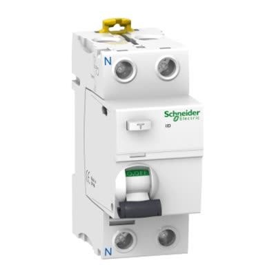

# Electrical Distribution Board Specification

**English** | [**Read in Georgian (ქართულად)**](README.ge.md)

A complete guide for building a modern, safe electrical distribution panel for a residential property with 17 individual circuits. This design uses high-quality Schneider Electric components with individual RCBO protection for each circuit.

## What is This System?

This electrical panel design provides:
- **Individual protection** for every circuit (no shared protection)
- **Automatic voltage monitoring** that disconnects power during voltage problems
- **Lightning protection** to safeguard expensive appliances
- **Fire protection** through ground fault detection
- **Selective tripping** - only the faulty circuit disconnects, others stay on

## System Overview

### Main Protection Components (What Comes First)

| Component | Part Number | Brand | Model | Description |
|-----------|-------------|-------|-------|-------------|
| **Voltage Monitor** | E1YM400VS10 | TELE | E1YM | Monitors incoming voltage (160-280V range); triggers contactor during under/overvoltage conditions |
| **Main Contactor** | LC1D40A | Schneider Electric | TeSys D | 40A contactor with 230V AC coil; acts as main disconnect controlled by voltage monitor |
| **Main Circuit Breaker** | A9F74163 | Schneider Electric | Acti9 iC60N | 1P+N 63A C-curve; provides overcurrent and short circuit protection (6kA breaking capacity) |
| **Main RCD** | A9R44263 | Schneider Electric | Acti9 iID | 2P 63A 300mA Type AC; time-delayed RCD for fire protection; detects ground faults |
| **Surge Protection** | A9L08501 | Schneider Electric | Acti9 iPRD 8r | 1P+N 8kA 350V Type 2 surge protector; protects against lightning and voltage spikes with remote signaling |
| **RCBOs - C10** | A9D32610 | Schneider Electric | Acti9 iDPN N Vigi | 1P+N 10A C-curve Type A 30mA; for refrigerators (1× unit) |
| **RCBOs - C16** | A9D32616 | Schneider Electric | Acti9 iDPN N Vigi | 1P+N 16A C-curve Type A 30mA; for rooms, bathrooms, ACs, laundry (11× units) |
| **RCBOs - C25** | A9D32625 | Schneider Electric | Acti9 iDPN N Vigi | 1P+N 25A C-curve Type A 30mA; for garage, oven, welder (3× units) |
| **RCBOs - C32** | A9D32632 | Schneider Electric | Acti9 iDPN N Vigi | 1P+N 32A C-curve Type A 30mA; for EV charger (1× unit) |

<table>
<tr>
<td width="50%" align="center">

**Voltage Monitor**<br/>TELE E1YM400VS10


Watches incoming voltage<br/>
Triggers contactor if voltage problems

</td>
<td width="50%" align="center">

**Contactor**<br/>Schneider LC1D40A


Main ON/OFF switch<br/>
Controlled by voltage monitor

</td>
</tr>
<tr>
<td width="50%" align="center">

**Main Circuit Breaker**<br/>Schneider iC60N 1P+N


Overcurrent & short circuit protection<br/>
C40/C50/C63 (choose based on contract)

</td>
<td width="50%" align="center">

**Main RCD (Fire Protection)**<br/>Schneider iID 2P 63A/300mA



Detects ground faults<br/>
Time-delayed, prevents fires

</td>
</tr>
<tr>
<td width="50%" align="center">

**Surge Protector**<br/>Schneider iPRD 8r 1P+N


Lightning & voltage spike protection<br/>
Saves appliances during storms

</td>
<td width="50%" align="center">

**RCBO (Individual Circuits)**<br/>Schneider iDPN Vigi Type A


17× individual protection circuits<br/>
C10/C16/C25/C32, 30mA per circuit

</td>
</tr>
</table>

### How Everything Connects

**System Diagram:** Complete busbar distribution showing all connections, busbars, and individual circuits.

<picture>
  <source srcset="imgs/busbar-distribution-v4.drawio-dark.png" media="(prefers-color-scheme: dark)">
  
</picture>

### RCBO Protection Explained

**RCBO = Residual Current Circuit Breaker with Overcurrent protection**

Each circuit gets its own RCBO that provides:
- Overcurrent protection (like a regular breaker)
- Ground fault protection (like a GFCI outlet)
- Instant disconnect if current leaks (30mA sensitivity)

**Benefits:**
- If one room has a problem, only that circuit trips
- Better safety than shared protection
- Easier troubleshooting (you know exactly which circuit failed)

## All 17 Circuits - What Gets Protected

Every circuit uses **Schneider Acti9 iDPN Vigi** RCBOs with these specifications:
- **Type A** - suitable for modern electronics, computers, LED lights
- **30mA sensitivity** - trips in 0.03 seconds if current leaks (very safe)
- **1P+N** - single phase + neutral (standard residential)
- **C-curve** - handles startup surges from motors, compressors

## Complete Circuit List

### 1-5: Living Spaces (All Rooms)
| # | What It Powers | RCBO | Max Load | Notes |
|---|----------------|------|----------|-------|
| 1 | Room 1 - all outlets & lights | C16 | 3,680W | Computers, TV, lamps, phone chargers |
| 2 | Room 2 - all outlets & lights | C16 | 3,680W | Same as above |
| 3 | Room 3 - all outlets & lights | C16 | 3,680W | Same as above |
| 4 | Garage - outlets & lights | C25 | 5,750W | Light-duty power tools, compressor, lighting |
| 5 | Studio - all outlets & lights | C16 | 3,680W | Workspace equipment, lighting |

### 6-7: Bathrooms
| # | What It Powers | RCBO | Max Load | Notes |
|---|----------------|------|----------|-------|
| 6 | Bathroom 1 - lights, outlets, fan | C16 | 3,680W | Hair dryer, electric razor, etc. |
| 7 | Bathroom 2 - lights, outlets, fan | C16 | 3,680W | Same as above |

### 8-11: Air Conditioning (One AC Per Room)
| # | What It Powers | RCBO | Max Load | Notes |
|---|----------------|------|----------|-------|
| 8 | Room 1 AC unit | C16 | 3,680W | Handles startup surge |
| 9 | Room 2 AC unit | C16 | 3,680W | Separate circuit = no interference |
| 10 | Room 3 AC unit | C16 | 3,680W | Each AC isolated for reliability |
| 11 | Studio AC unit | C16 | 3,680W | Studio stays cool independently |

### 12-14: Kitchen Appliances
| # | What It Powers | RCBO | Max Load | Notes |
|---|----------------|------|----------|-------|
| 12 | Refrigerators (main + wine fridge) | C10 | 2,300W | Smaller breaker = less nuisance tripping |
| 13 | Electric oven | C25 | 5,750W | Heavy-duty circuit for high power |
| 14 | Dishwasher | C16 | 3,680W | Heating element draws significant current |

### 15: Laundry Room
| # | What It Powers | RCBO | Max Load | Notes |
|---|----------------|------|----------|-------|
| 15 | Washing machine & Clothes dryer | C16 | 3,680W | Combined circuit for both appliances |

### 16-17: Garage Heavy Equipment
| # | What It Powers | RCBO | Max Load | Notes |
|---|----------------|------|----------|-------|
| 16 | EV Charger (Level 2) | C32 | 7,360W | 32A dedicated circuit for electric vehicle charging |
| 17 | MIG Welder (IPOTOOLS MIG 225SYN) | C25 | 5,750W | 225A welding machine, requires dedicated circuit |

## Shopping List - What to Buy

### Main Control Components (5 items)
| Qty | Part Number | Description | Approx. Price Range |
|-----|-------------|-------------|---------------------|
| 1 | TELE E1YM400VS10 | Voltage monitor relay | ₾200-300 (€80-120) |
| 1 | Schneider LC1D40A | Contactor 40A + coil (230V AC) | ₾100-150 (€40-60) |
| 1 | Schneider iC60N 1P+N C40 | Main breaker 1P+N (choose C40, C50, or C63) | ₾80-120 (€30-45) |
| 1 | Schneider iID 2P 63A 300mA Type AC | Main RCD 2-pole (time-delayed) | ₾200-300 (€80-120) |
| 1 | Schneider iPRD 8r 1P+N | Surge protection device (single-phase) | ₾150-250 (€60-100) |

### Individual Circuit Protection (17 RCBOs)
| Qty | Part Number | For Which Circuits | Approx. Price Each |
|-----|-------------|--------------------|--------------------|
| 11 | Schneider iDPN Vigi Type A C16 30mA (A9D32616) | Rooms, bathrooms, ACs, dishwasher, laundry | ₾120-160 (€45-65) |
| 1 | Schneider iDPN Vigi Type A C10 30mA (A9D32610) | Refrigerators only | ₾120-160 (€45-65) |
| 3 | Schneider iDPN Vigi Type A C25 30mA (A9D32625) | Garage, electric oven, welder | ₾120-160 (€45-65) |
| 1 | Schneider iDPN Vigi Type A C32 30mA (A9D32632) | EV charger only | ₾120-160 (€45-65) |

### Additional Materials Needed
- Distribution board enclosure (min. 30 modules wide)
- Busbar (single-phase + neutral)
- Wire: 1.5mm² for C10, 2.5mm² for C16, 4mm² for C25, 6mm² for C32
- Circuit labels and marker
- Din rail clips and cable ties

**Estimated Total Cost: ₾3,000 - ₾4,500 (€1,200 - €1,800)** (parts only, excluding labor)

## Critical Installation Instructions

### ⚠️ DANGER - Read Before Installing

**1. Neutral Segregation (MOST IMPORTANT)**
- Each RCBO has its own neutral terminal
- **NEVER** share neutrals between circuits
- Wrong: Two circuits sharing one neutral = RCBO won't work
- Right: Circuit 1 neutral → RCBO 1, Circuit 2 neutral → RCBO 2
- **Violation causes**: nuisance tripping, safety hazards, fire risk

### 2. Proper Connection Sequence
Follow this order exactly:
1. Install main breaker first (grid connection)
2. Connect main RCD after breaker
3. Install contactor after RCD
4. Wire voltage monitor to contactor coil
5. Install surge protector on separate branch
6. Install all 17 RCBOs in a row
7. Connect busbar to distribute power to all RCBOs

### 3. Wiring Standards
- Use **2.5mm²** copper wire for C16 RCBOs (16A circuits)
- Use **1.5mm²** copper wire for C10 RCBO (refrigerator circuit)
- Use **4mm²** copper wire for C25 RCBO (oven circuit)
- All connections must be tight (use torque screwdriver: 2-2.5 Nm)

### 4. Testing Procedure
Before connecting any loads:
1. Test main breaker operation (manual trip)
2. Test main RCD test button (should trip at 300mA)
3. Test each RCBO test button (should trip at 30mA)
4. Verify voltage monitor triggers contactor
5. Measure voltage at each RCBO output

### 5. Labeling
Print and attach labels to each RCBO:
```
Circuit 1: Room 1 Outlets/Lights
Circuit 2: Room 2 Outlets/Lights
Circuit 3: Room 3 Outlets/Lights
Circuit 4: Garage Outlets/Lights
Circuit 5: Studio Outlets/Lights
Circuit 6: Bathroom 1
Circuit 7: Bathroom 2
Circuit 8: AC - Room 1
Circuit 9: AC - Room 2
Circuit 10: AC - Room 3
Circuit 11: AC - Studio
Circuit 12: Refrigerators
Circuit 13: Electric Oven
Circuit 14: Dishwasher
Circuit 15: Washing Machine & Dryer
Circuit 16: EV Charger (Garage)
Circuit 17: MIG Welder (Garage)
```

## Advanced Options

### Upgrade to Type F RCBOs (Optional)
If you have modern inverter-based appliances:
- **Consider Type F** for circuits 8-11 (AC units), 15 (washing machine & dryer), 16 (EV charger), and 17 (inverter welder)
- Type F RCBOs handle DC fault currents better from inverter-based equipment
- Cost: ~€10-15 more per unit
- **Highly recommended for EV charger and inverter welder circuits**

### Garage Heavy Equipment Notes
**EV Charger (Circuit 16):**
- 32A dedicated circuit provides ~7.3kW charging (Level 2)
- Use 6mm² copper wire minimum
- Consider upgrading to Type F RCBO for better protection
- Never run EV charger and welder simultaneously at full power

**MIG Welder (Circuit 17):**
- IPOTOOLS MIG 225SYN: 225A output, ~20A input at 230V
- Draws 4-5kW at maximum output
- C25 RCBO provides adequate protection
- Dedicated circuit prevents voltage drops during welding

**Garage General Circuit (Circuit 4):**
- C25 rating for light-duty tools, air compressor, lighting
- Not for simultaneous use with welder or EV charger

### Why Refrigerators Get C10 Instead of C16
- Refrigerator compressors cause small current surges
- C10 breaker is "closer" to normal operating current
- Better discrimination = less false tripping
- Still safe (refrigerators typically draw 1-3A)

---

*Document prepared with assistance*
