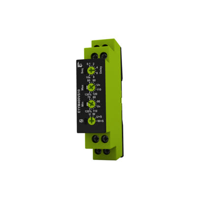
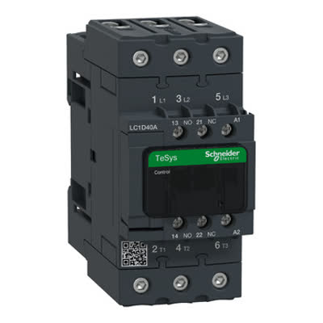
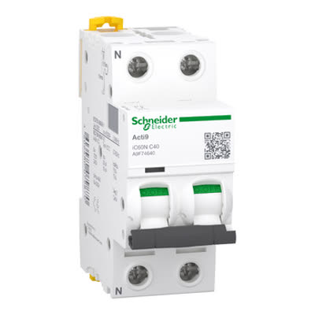
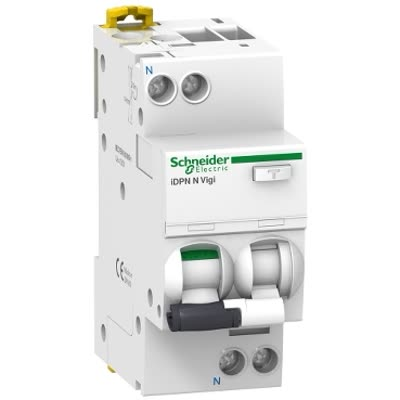
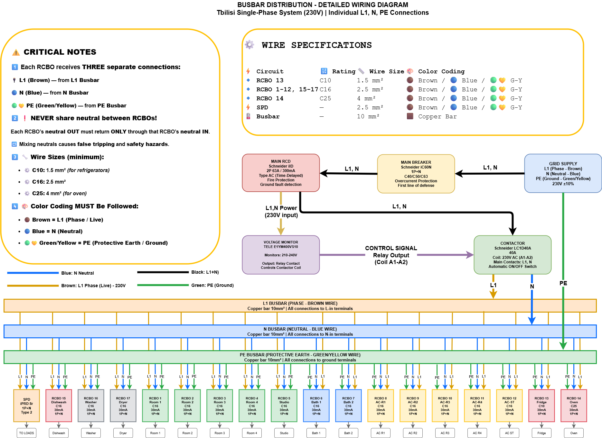

# Electrical Distribution Board Specification

**English** | [**Read in Georgian (ქართულად)**](README.ge.md)

A complete guide for building a modern, safe electrical distribution panel for a residential property with 15 individual circuits. This design uses high-quality Hager components with individual RCBO protection for each circuit.

## What is This System?

This electrical panel design provides:
- **Individual protection** for every circuit (no shared protection)
- **Automatic voltage monitoring** that disconnects power during voltage problems
- **Lightning protection** to safeguard expensive appliances
- **Earth leakage protection** with 30mA RCBOs on every circuit
- **Selective tripping** - only the faulty circuit disconnects, others stay on

## System Overview

### Main Protection Components (What Comes First)

| Qty | Component | Part Number | Brand | Model | Description |
|-----|-----------|-------------|-------|-------|-------------|
| 1× | **Voltage Monitor** | E1YM400VS10 | TELE | E1YM | Monitors incoming voltage (160-280V range); triggers contactor during under/overvoltage conditions |
| 1× | **Main Contactor** | ESC263 | Hager | ESC | 2P 63A contactor with 230V AC coil; 2 NO contacts; acts as main disconnect controlled by voltage monitor |
| 1× | **Main Circuit Breaker** | MCN163 | Hager | MCN | 1P 63A C-curve; provides overcurrent and short circuit protection (6kA breaking capacity) |
| 1× | **Surge Protection** | SPL220 | Hager | SPL | 1P+N 20kA Type 2 surge protector; protects against lightning and voltage spikes |
| 12× | **RCBOs - C16** | ADC916R | Hager | ADC | 1P+N 16A C-curve Type A 30mA 6kA; for rooms, bathrooms, ACs, laundry, refrigerators |
| 2× | **RCBOs - C25** | ADC925R | Hager | ADC | 1P+N 25A C-curve Type A 30mA 6kA; for oven, welder |
| 1× | **RCBOs - C32** | ADC932R | Hager | ADC | 1P+N 32A C-curve Type A 30mA 6kA; for EV charger |

<table>
<tr>
<td width="50%" align="center">

**Voltage Monitor**<br/>TELE E1YM400VS10



Watches incoming voltage<br/>
Triggers contactor if voltage problems

</td>
<td width="50%" align="center">

**Contactor**<br/>Hager ESC263



Main ON/OFF switch 63A<br/>
Controlled by voltage monitor

</td>
</tr>
<tr>
<td width="50%" align="center">

**Main Circuit Breaker**<br/>Hager MCN 1P



Overcurrent & short circuit protection<br/>
C63 6kA

</td>
<td width="50%" align="center">

**Surge Protector**<br/>Hager SPL 1P+N Type 2



Lightning & voltage spike protection<br/>
Saves appliances during storms

</td>
<td width="50%" align="center">

**RCBO (Individual Circuits)**<br/>Hager ADC Type A


15× individual protection circuits<br/>
C16/C25/C32, 30mA per circuit

</td>
</tr>
</table>

### How Everything Connects

**System Diagram:** Complete busbar distribution showing all connections, busbars, and individual circuits.

<picture>
  <source srcset="imgs/busbar-distribution-v4.drawio-dark.png" media="(prefers-color-scheme: dark)">
  
</picture>

### RCBO Protection Explained

**RCBO = Residual Current Circuit Breaker with Overcurrent protection**

Each circuit gets its own RCBO that provides:
- Overcurrent protection (like a regular breaker)
- Ground fault protection (like a GFCI outlet)
- Instant disconnect if current leaks (30mA sensitivity)

**Benefits:**
- If one room has a problem, only that circuit trips
- Better safety than shared protection
- Easier troubleshooting (you know exactly which circuit failed)

## All 15 Circuits - What Gets Protected

Every circuit uses **Hager ADC** RCBOs with these specifications:
- **Type A** - suitable for modern electronics, computers, LED lights
- **30mA sensitivity** - trips in 0.03 seconds if current leaks (very safe)
- **1P+N** - single phase + neutral (standard residential)
- **C-curve** - handles startup surges from motors, compressors

## Complete Circuit List

### 1-4: Living Spaces (All Rooms)
| # | What It Powers | RCBO | Max Load | Notes |
|---|----------------|------|----------|-------|
| 1 | Room 1 - all outlets & lights | C16 | 3,680W | Computers, TV, lamps, phone chargers |
| 2 | Room 2 - all outlets & lights | C16 | 3,680W | Same as above |
| 3 | Room 3 - all outlets & lights | C16 | 3,680W | Same as above |
| 4 | Studio - all outlets & lights | C16 | 3,680W | Workspace equipment, lighting |

### 5-6: Bathrooms
| # | What It Powers | RCBO | Max Load | Notes |
|---|----------------|------|----------|-------|
| 5 | Bathroom 1 - lights, outlets, fan | C16 | 3,680W | Hair dryer, electric razor, etc. |
| 6 | Bathroom 2 - lights, outlets, fan | C16 | 3,680W | Same as above |

### 7-10: Air Conditioning (One AC Per Room)
| # | What It Powers | RCBO | Max Load | Notes |
|---|----------------|------|----------|-------|
| 7 | Room 1 AC unit | C16 | 3,680W | Handles startup surge |
| 8 | Room 2 AC unit | C16 | 3,680W | Separate circuit = no interference |
| 9 | Room 3 AC unit | C16 | 3,680W | Each AC isolated for reliability |
| 10 | Studio AC unit | C16 | 3,680W | Studio stays cool independently |

### 11-13: Kitchen Appliances
| # | What It Powers | RCBO | Max Load | Notes |
|---|----------------|------|----------|-------|
| 11 | Refrigerators (main + wine fridge) | C16 | 3,680W | Standard protection for refrigerators |
| 12 | Electric oven | C25 | 5,750W | Heavy-duty circuit for high power |
| 13 | Dishwasher | C16 | 3,680W | Heating element draws significant current |

### 14: Laundry Room
| # | What It Powers | RCBO | Max Load | Notes |
|---|----------------|------|----------|-------|
| 14 | Washing machine & Clothes dryer | C16 | 3,680W | Combined circuit for both appliances |

### 15-16: Heavy Equipment
| # | What It Powers | RCBO | Max Load | Notes |
|---|----------------|------|----------|-------|
| 15 | EV Charger (Level 2) | C32 | 7,360W | 32A dedicated circuit for electric vehicle charging |
| 16 | MIG Welder (IPOTOOLS MIG 225SYN) | C25 | 5,750W | 225A welding machine, requires dedicated circuit |

## Shopping List - What to Buy

### Main Control Components (4 items)
| Qty | Part Number | Description | Approx. Price Range |
|-----|-------------|-------------|---------------------|
| 1 | TELE E1YM400VS10 | Voltage monitor relay | ₾200-300 (€80-120) |
| 1 | Hager ESC263 | Contactor 63A 2NO + coil (230V AC) | ₾120-180 (€50-70) |
| 1 | Hager MCN163 | Main breaker 1P C63 6kA | ₾70-100 (€30-40) |
| 1 | Hager SPL220 | Surge protection device Type 2 1P+N 20kA | ₾120-200 (€50-80) |

### Individual Circuit Protection (15 RCBOs)
| Qty | Part Number | For Which Circuits | Approx. Price Each |
|-----|-------------|--------------------|--------------------|
| 12 | Hager ADC916R | Rooms, bathrooms, ACs, dishwasher, laundry, refrigerators (C16 Type A 30mA) | ₾100-140 (€40-55) |
| 2 | Hager ADC925R | Electric oven, welder (C25 Type A 30mA) | ₾100-140 (€40-55) |
| 1 | Hager ADC932R | EV charger only (C32 Type A 30mA) | ₾100-140 (€40-55) |

### Additional Materials Needed
- Distribution board enclosure (min. 24 modules wide)
- Busbar (single-phase + neutral)
- Wire: 2.5mm² for C16, 4mm² for C25, 6mm² for C32
- Circuit labels and marker
- Din rail clips and cable ties

**Note:** No main RCD required - all circuits protected by individual 30mA RCBOs

**Estimated Total Cost: ₾2,600 - ₾4,000 (€1,050 - €1,600)** (parts only, excluding labor)

## Critical Installation Instructions

### ⚠️ DANGER - Read Before Installing

**1. Neutral Segregation (MOST IMPORTANT)**
- Each RCBO has its own neutral terminal
- **NEVER** share neutrals between circuits
- Wrong: Two circuits sharing one neutral = RCBO won't work
- Right: Circuit 1 neutral → RCBO 1, Circuit 2 neutral → RCBO 2
- **Violation causes**: nuisance tripping, safety hazards, fire risk

### 2. Proper Connection Sequence
Follow this order exactly:
1. Install main breaker first (grid connection)
2. Install contactor after breaker
3. Wire voltage monitor to contactor coil
4. Install surge protector on separate branch
5. Install all 15 RCBOs in a row
6. Connect busbar to distribute power to all RCBOs

### 3. Wiring Standards
- Use **2.5mm²** copper wire for C16 RCBOs (16A circuits)
- Use **4mm²** copper wire for C25 RCBOs (25A circuits)
- Use **6mm²** copper wire for C32 RCBO (32A EV charger circuit)
- All connections must be tight (use torque screwdriver: 2-2.5 Nm)

### 4. Testing Procedure
Before connecting any loads:
1. Test main breaker operation (manual trip)
2. Test each RCBO test button (should trip at 30mA)
3. Verify voltage monitor triggers contactor
4. Measure voltage at each RCBO output

### 5. Labeling
Print and attach labels to each RCBO:
```
Circuit 1: Room 1 Outlets/Lights
Circuit 2: Room 2 Outlets/Lights
Circuit 3: Room 3 Outlets/Lights
Circuit 4: Studio Outlets/Lights
Circuit 5: Bathroom 1
Circuit 6: Bathroom 2
Circuit 7: AC - Room 1
Circuit 8: AC - Room 2
Circuit 9: AC - Room 3
Circuit 10: AC - Studio
Circuit 11: Refrigerators
Circuit 12: Electric Oven
Circuit 13: Dishwasher
Circuit 14: Washing Machine & Dryer
Circuit 15: EV Charger
Circuit 16: MIG Welder
```

## Advanced Options

### Upgrade to Type F RCBOs (Optional)
If you have modern inverter-based appliances:
- **Consider Type F** for circuits 7-10 (AC units), 14 (washing machine & dryer), 15 (EV charger), and 16 (inverter welder)
- Type F RCBOs handle DC fault currents better from inverter-based equipment
- Cost: ~€10-15 more per unit
- **Highly recommended for EV charger and inverter welder circuits**

### Heavy Equipment Notes
**EV Charger (Circuit 15):**
- 32A dedicated circuit provides ~7.3kW charging (Level 2)
- Use 6mm² copper wire minimum
- Consider upgrading to Type F RCBO for better protection
- Never run EV charger and welder simultaneously at full power

**MIG Welder (Circuit 16):**
- IPOTOOLS MIG 225SYN: 225A output, ~20A input at 230V
- Draws 4-5kW at maximum output
- C25 RCBO provides adequate protection
- Dedicated circuit prevents voltage drops during welding

### Why Refrigerators Use C16
- Refrigerators typically draw 1-3A during normal operation
- C16 provides adequate protection without nuisance tripping
- Handles compressor startup surges reliably
- Standard rating simplifies component inventory

---

*Document prepared with assistance*
